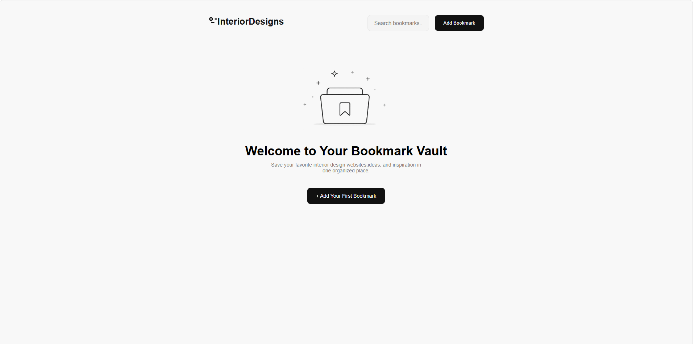
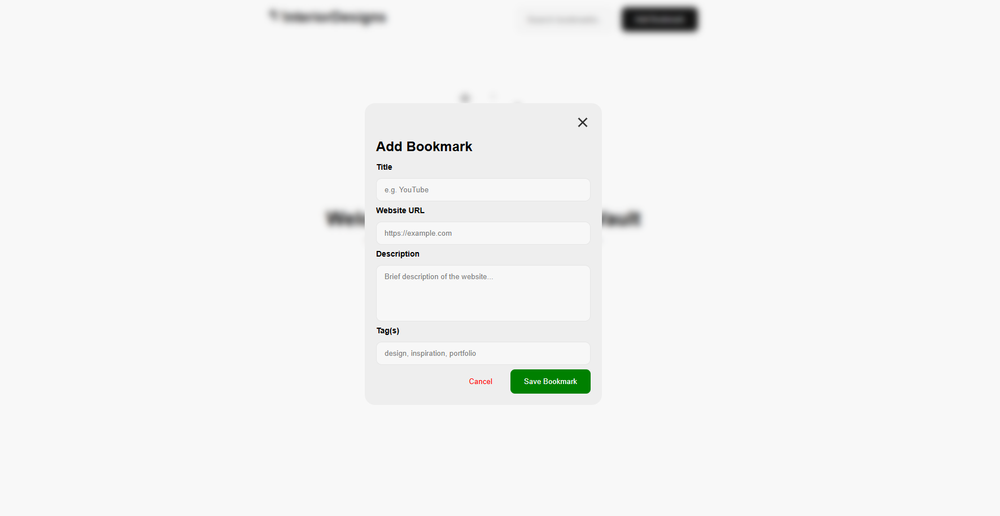
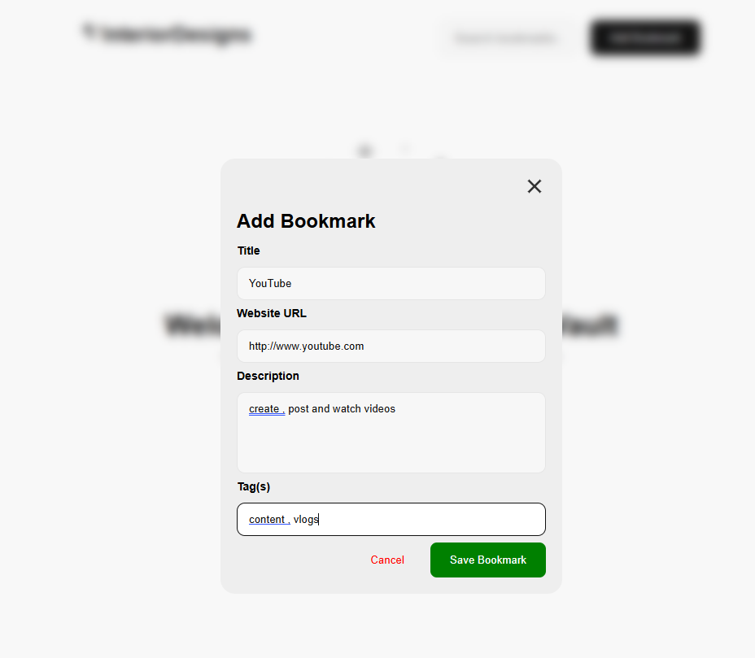
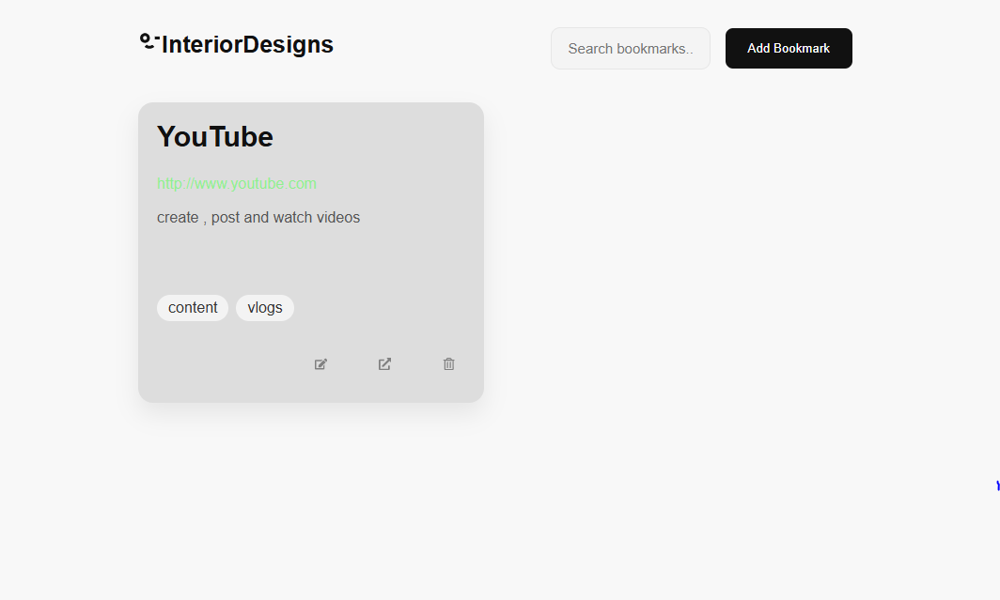

#  Interior Designs Bookmark Manager

A modern and responsive React application for saving, organizing, and managing your favorite interior design websites, inspiration pages, and resources.

Built with **React**, **TypeScript**, and **CSS**, the application allows users to add, edit, search, and delete bookmarks while automatically storing data in the browser using Local Storage

---

## Preview









---

## Features

- Add new bookmarks
-  Edit existing bookmarks
-  Delete bookmarks with confirmation modal
-  Search bookmarks by:
     - Title
     - URL
     - Description
    - Tags
-  Organize bookmarks with tags
-  Persistent storage using Local Storage
-  Prevents duplicate bookmarks
-  Success and error notifications
-  Fully responsive design
-  Clean dashboard interface


## Technologies Used

- React
- TypeScript
- CSS
- React Icons
- Local Storage API
- Vite
- Vercel

##  Responsive Design

The application is responsive across multiple screen sizes:

| Device       | Width |
|--------------|-------|
| Mobile       | 320px |
| Large Mobile | 480px |
| Tablet       | 768px |
| Laptop       | 1024px |
| Desktop      | 1200px+ |


##  Usage

1. Click **Add Bookmark**
2. Enter:
   - Website title
   - URL
   - Description
   - Tags
3. Save the bookmark.
4. Search using the search bar.
5. Edit or delete bookmarks whenever needed.


##  Data Storage

All bookmarks are stored locally in your browser using the **Local Storage API**.

No backend or database is required.

##  Getting Started

### Clone the repository

```bash
git clone https://github.com/Lutricia-The-Coder/interiordesigns.git
```

### Navigate into the project

```bash
cd interiordesigns
```

### Install dependencies

```bash
npm install
```

### Start the development server

```bash
npm run dev
```

The application will be available at:

```
http://localhost:5173
```
could be a different port depending on if your other ports are not in use.

##  Future Improvements

-  Favorite bookmarks
-  Categories
-  Dark mode
-  Import / Export bookmarks
-  Sorting options
-  Website favicons
-  Cloud storage
-  User authentication

 To check the live site **interior-designs-vcve.vercel.app**
